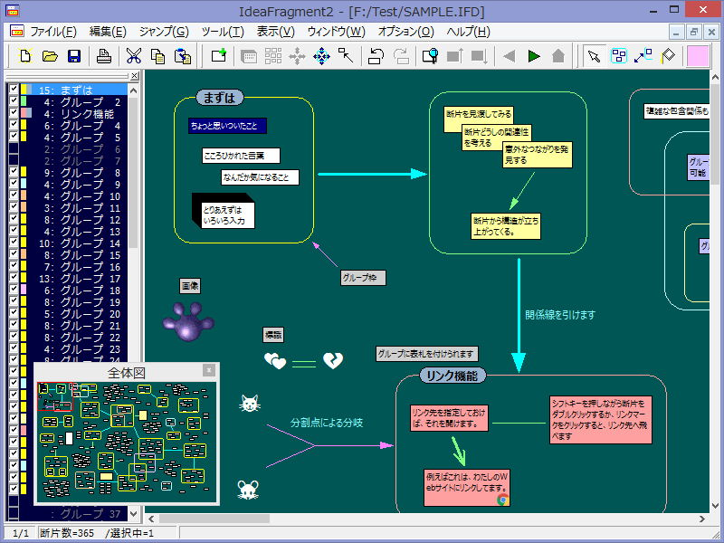

# IdeaFragment2

IdeaFragment2 is a thinking support tool for Windows.  

Supported language is Japanese only.  

## Download Executable File
http://nekomimi.la.coocan.jp/freesoft/ideafrg2.htm  

## Development Environment
C++Builder 10.4.2 (BCC32C)
